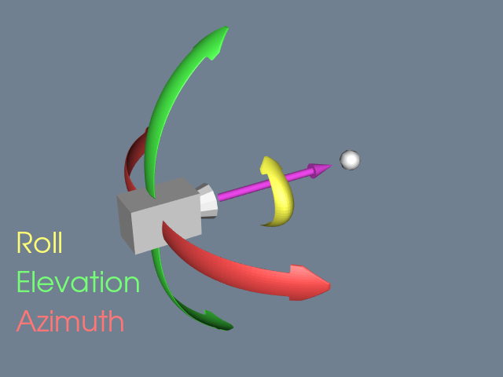
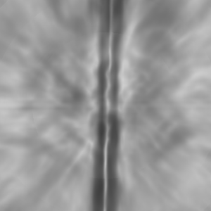
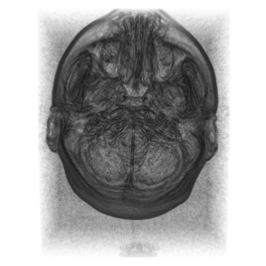
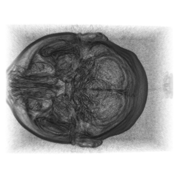
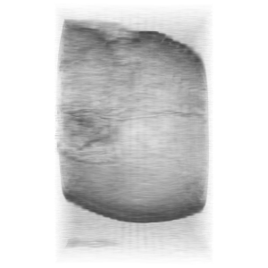

# Sanic Project

## Setup

`pip install sanic`

## Run

`git clone https://github.com/dobatruong1111/sanic_project.git`
`cd sanic_project`  
`sanic main.app`

## Demo

### APIs

#### Get Cone Image

GET `http://localhost:8000/get_image`  
GET `http://localhost:8000/get_image?position=5&roll=180&azimuth=90&elevation=90`

#### Get Dicom Image

GET `http://localhost:8000/get_image_dicom`  
GET `http://localhost:8000/get_image_dicom?position=500&roll=90&azimuth=90&elevation=90`

## Mô tả

### Thao tác với camera:  

 

Xét khoảng clipping range là: 0.1...5000  
Xét vị trí ban đầu của camera là: (0, 0, 0.1)  

Ảnh ban đầu:  

Ảnh sau khi xét position bằng 500:  

Ảnh sau khi xoay 90 độ quanh trục z (roll):  

Ảnh sau khi xoay 90 độ quanh trục y (azimuth):  

Ảnh sau khi xoay 90 độ quanh trục x (elevation):  

Ảnh sau khi xoay 90 độ quanh theo cả 3 trục tọa độ lần lượt z (roll), y (azimuth), x (elevation):  

